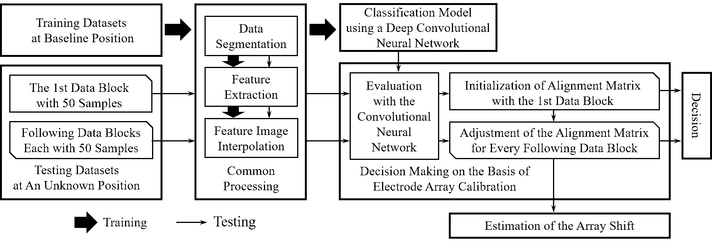
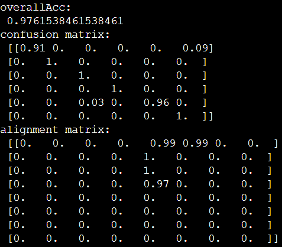

# Adaptive Calibration of Electrode Array Shifts toward Robust Myoelectric Control
By [Xu Zhang](https://est.ustc.edu.cn/2015/0729/c4618a42767/page.psp), [Le Wu](https://github.com/wule1994), Bin Yu, [Xiang Chen](https://scholar.google.com/citations?hl=en&user=JURnq4QAAAAJ), [Xun Chen](http://staff.ustc.edu.cn/~xunchen/index.htm)

This code is to automatic and adaptive calibration of electrode array and assist to enhance robustness of myoelectric control systems. The code is developed based on the Keras framwork.

## Introduction

Overview of the proposed method. Given the current electrode array as an example, we assumed that any electrode shift was no greater than 7mm along both the proximal/distal and left/right directions (any larger deviation can be easily sensed). Therefore, a central region, covered by the central portion of electrode array, is supposed to be always covered by various shift conditions. This region is termed as core recording region (CRR). The classification model only trained with the data from CRR at the baseline position. During the testing phase, given the unknown but reasonably small shift of the electrode array, it is assumed that the muscle area corresponding to the CRR is still covered by the array. Therefore, the myoelectric pattern recognition can be achieved by considering the learnt HD-sEMG image corresponding to the CRR as an object to be detected within the entire array image.

### License

The reposity is released under the Apache-2.0 License (refer to the LICENSE file for details).

## Installing dependencies
* **Keras (version: 2.2.4)**: we use tensorflow backend. The Keras installation and introduction are available at `https://keras.io/`.
* **tensorflow (version: 1.13.1)**: tensorflow installation instructions are available at `https://www.tensorflow.org/`.

## demo
for using the code, you have to do something else:

### preparation
* download [data folder](https://drive.google.com/file/d/1LsSEDZS2wbthcNZeqBXdfE-hNCIc6Cif/view?usp=sharing), this folder contains `training data` from baseline position and `testing data` from shift position.
* download [model folder](https://drive.google.com/file/d/1aC1t7AHnsG10E6x76A6kFEUHyfSIpcrJ/view?usp=sharing), this folder includes `VGG16 weight` and a `pretrined model`. The pretrained model trained only with the data from the baseline position.

For more details, you can referring to the correspond code files or leave a message in the issue.

### training
Then, you just input the following sentence to train it.
```bash
python train.py
```
***Or you can skip this step using our pretrained model.***

### Result
To get the results, you need to input the following sentence:
```bash
python demo.py
```
***Note: if you use the model trained by yourself, please uncomment line 181 and comment line 182 in the demo.py.***
The final classfication accuracy is 0.9762. The confusion matrix and alignment matrix are also printed in the window.

